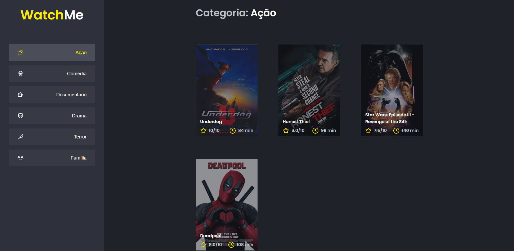
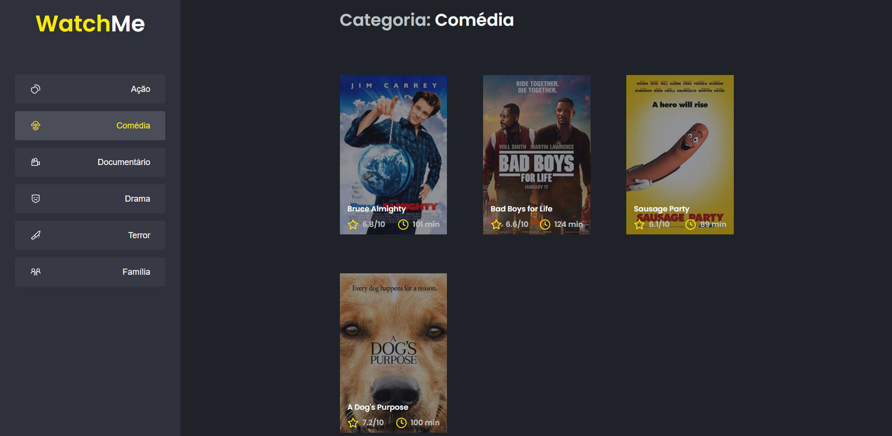
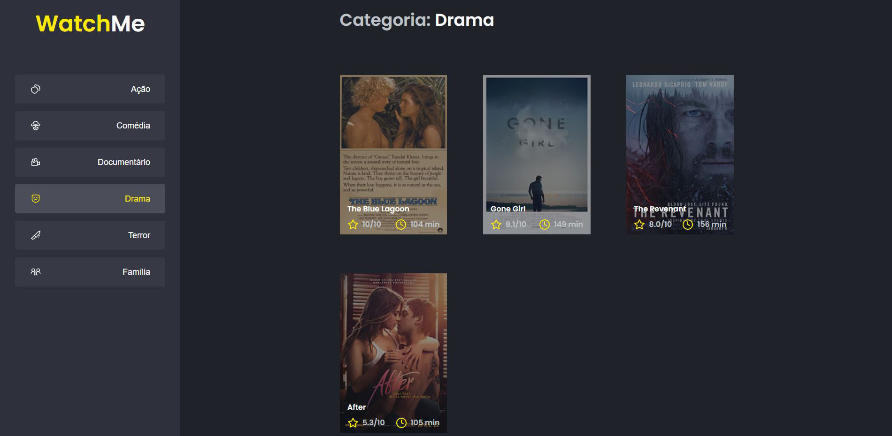
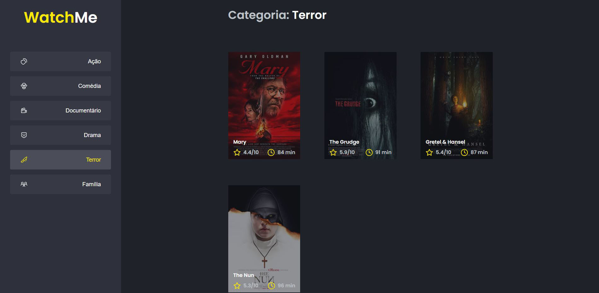
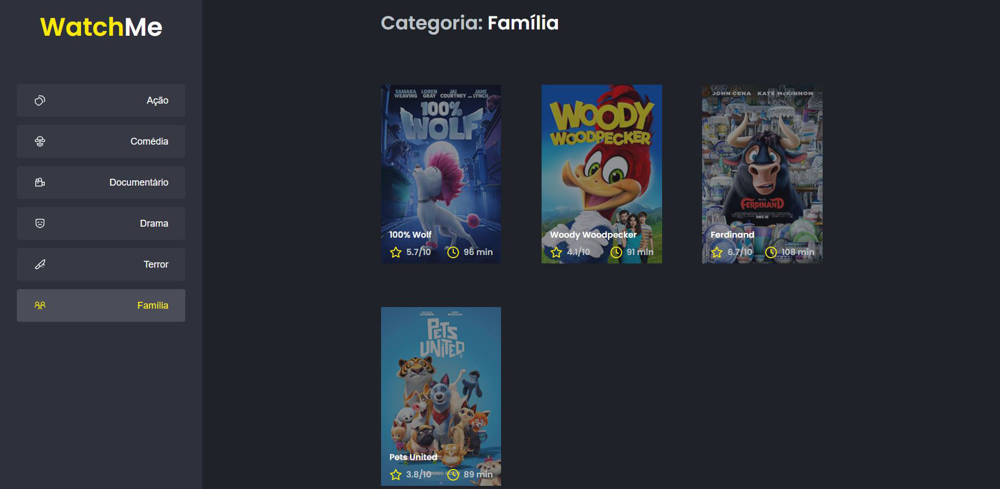

<h1 align="center">
     WatchMe
</h1>

<p align="center">  
 WatchMe é um dos desafios do capítulo 1 da trilha de ReactJs do Ignite da <a href="https://rocketseat.com.br/">Rocketseat</a>
</p>

<h4 align="center">
	🚧 Concluído 🚀 🚧
</h4>

Tabela de conteúdos
=================
<!--ts-->
   * [Sobre o projeto](#-sobre-o-projeto)
   * [Layout](#-layout)
     * [Web](#web)
   * [Como executar o projeto](#-como-executar-o-projeto)
   * [Tecnologias](#-tecnologias)
   * [Licença](#user-content--licença)
<!--te-->


## 💻 Sobre o projeto

<p>O projeto usa uma Fake API JSON para exibir os filmes de acordo com a sua categoria</p>
<p>O objetivo desse desafio era refatorar o código da aplicação que tinha toda a logica dentro do componente APP.jsx dividindo em 2 partes. <br>
O componente SideBar.jsx deve ficar responsável pela listagem de todos os gênero de filme e o componente Content.jsx deve exibir os filmes da categoria escolhida</p>

## 🎨 Layout

### Web

<p align="center" style="display: flex; align-items: flex-start; justify-content: center;">
  
  
  
  
    
  
</p>

## 🚀 Como executar o projeto

Para executar esse projeto, você deve abrir 2 terminais um para iniciar a aplicação e outro o JSON Server.

### Pré-requisitos

Antes de começar, você vai precisar ter instalado em sua máquina as seguintes ferramentas:
[Git](https://git-scm.com), [Node.js](https://nodejs.org/en/). 
Além disto é bom ter um editor para trabalhar com o código como [VSCode](https://code.visualstudio.com/)

#### Rodando a aplicação web (Frontend)

```bash

# Clone este repositório
$ git clone https://github.com/Tuhh16/desafio-02-trilha-reactjs.git

# Acesse a pasta do projeto no seu terminal/cmd
$ cd desafio-02-trilha-reactjs

# Instale as dependências
$ yarn install

# Execute a aplicação em modo de desenvolvimento
$ yarn dev

# A aplicação será aberta na porta:8080 - acesse http://localhost:8080

# Para iniciar o backend basta iniciar o json server seguindo os seguintes passos

# Acesse a pasta do projeto no seu terminal/cmd
$ cd desafio-02-trilha-reactjs

# Execute a aplicação em modo de desenvolvimento
$ yarn server

# A aplicação será aberta na porta:3333 - acesse http://localhost:3333

```

---

## 🛠 Tecnologias

As seguintes ferramentas foram usadas na construção do projeto:

-   **[ReactJs](https://pt-br.reactjs.org/)**
-   **[TypeScript](https://www.typescriptlang.org/)**

---

## 📝 Licença

Este projeto esta sobe a licença [MIT](./LICENSE).

Feito por Arthur Teodoro Alves de Lima 👋🏽 [Entre em contato!](https://www.linkedin.com/in/arthur-lima-reactjs/)
